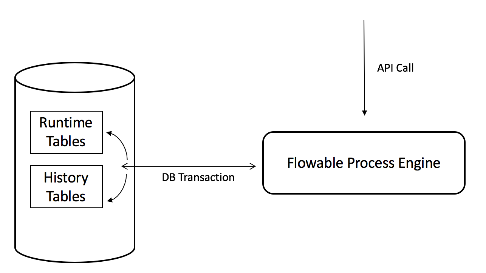
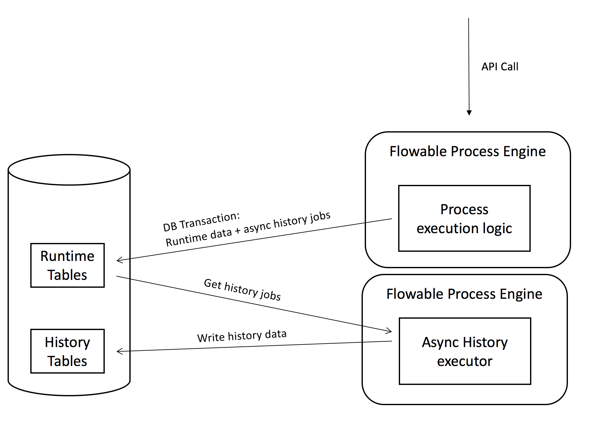

## Example: Flowable async history configuration

### Description

This example shows how to enable async history and to activate the default async history executor.

In the default setup (where async history is disabled), history data is written to the history database tables in the same database transaction as the runtime data. 



When async history is enabled, this history data is not written to the history tables, but instead a job is inserted that will be executed at a later point in time. This job is inserted in the same transaction as the runtime data, as this is crucial for correct audit data. If it wasn't written in the same database transaction, the runtime data could be rolled back due to some exception whilst the history data could show that something else happened.

By default, a component using threadpools is used to process the async history jobs called the 'Async History Executor'. This executor is in fact nothing more than an instance of the regular 'Async Executor' (that's used for async jobs, timers, etc.), but configured to only pick up and handle async history jobs.

These jobs contain all the data (stored as JSON) that normally would be written to the database immediately in different rows over different tables. In fact, the default job handler for these async history jobs simply applies this data in the same way as the non-async-history case. The only difference is that the data is processed later. This usually gives a slight performance boost, as inserting the jobs is faster than inserting into various history tables (but not much, unless having lots of automatic steps after each other). 

The picture below illustrates this point. During the database transaction of the API call, the runtime data and the history jobs are inserted in the runtime tables. Later and asynchronously, the Async History Executor is polling the database, fetching these jobs and applying the history data in those jobs to the history tables.


In this default setup, the Async History Executor polls the database for new work. This should be okay for most use cases. See the more advanced examples that use a message queue to solve this. 

It's also possible to run the async history executor (similar to the async job executor) on a different server. Currently, this means booting up a 'light' process engine that doesn't do more than booting up the async history executor, but extracting these executors out to be a standalone component is planned for the future.



A small derivation can be made to the above setups, by switching the default job handler for async history jobs to an implementation that could use the historical data in various ways. Use the _customHistoryJobHandlers_ property on the process engine configuration for this purpose.

### Dependencies

The only dependencies we're using here are the Flowable engine, Flowable-Spring (as we're going to use the process engine from a Spring environment), the H2 in memory database and the Hikdari connection pooling framework:

```xml
<dependency>
	<groupId>org.flowable</groupId>
	<artifactId>flowable-engine</artifactId>
	<version>${flowable.version}</version>
</dependency>
<dependency>
	<groupId>org.flowable</groupId>
	<artifactId>flowable-spring</artifactId>
	<version>${flowable.version}</version>
</dependency>
		
<dependency>
	<groupId>com.h2database</groupId>
	<artifactId>h2</artifactId>
	<version>1.3.176</version>
</dependency>
		
<dependency>
	<groupId>com.zaxxer</groupId>
	<artifactId>HikariCP</artifactId>
	<version>2.6.3</version>
</dependency>
``` 

### Code 
 
Let's first look at [the example process](src/main/resources/test-process.bpmn20.xml) that we'll be using here. It's a simple BPMN 2.0 process with a few user tasks that are assigned using process variables mixed with some service tasks. And some parallel gateways to make it a bit more complex.
 
The process definition is deployed, started and its user tasks completed in the [src/main/java/org/flowable/Example](src/main/java/org/flowable/Example.java) class. The process engines is booted up from a Spring environment. Have a look if you're interested in that, but the main point about this example here is the configuration.
 
 The configuration is found in the [src/main/java/org/flowable/Configuration](src/main/java/org/flowable/Configuration.java) class.
 
 The following lines enable the async history:
 
 ```java
config.setAsyncHistoryEnabled(true);
config.setAsyncHistoryExecutorActivate(true);
```

The first line enables the async history executor, the second line activates it on boot (sometimes you don't want that immediately, like for tests).
Now history won't be written to the database in the same transaction, but at a later point in time. Note that this means the history data will not be synchronized with the runtime state, as this is in the default use case.

In the Configuration class, also three (optional) settings are used:

```java
config.setAsyncHistoryJsonGroupingEnabled(true);
config.setAsyncHistoryJsonGroupingThreshold(10);
config.setAsyncHistoryJsonGzipCompressionEnabled(false);
```

The first and second setting are related: if json grouping is enabled, one job will be created for all historical events, with of course a larger JSON payload. By default it's one job for each event. The second setting defines the threshold for applying such grouping. Our benchmarks have shown that the extra overhead of grouping only makes sense when having a larger amount of historical actions in one transaction. In this example, one job is created when there would be more than 10 (which is the default too, if not setting it) jobs async history jobs in the same transaction. Note that due to the granularity of some historical data, this happens quicker than one might think.

The third setting enables gzip compression (via the JDK GZIPOutputStream) on the JSON stored with the async history job. Our benchmarks have shown this only makes sense when having grouping enabled for two reasons. First, combining the JSON of different jobs adds lots of repitition in the same JSON data, which is perfect for applying compression, but there is not much repeition in a single string of JSON for one historical action. Secondly, applying the compression does use extra CPU resources which only make sense to use if the actual compressed size of the JSON mandates a substantial diminution in storage resources.