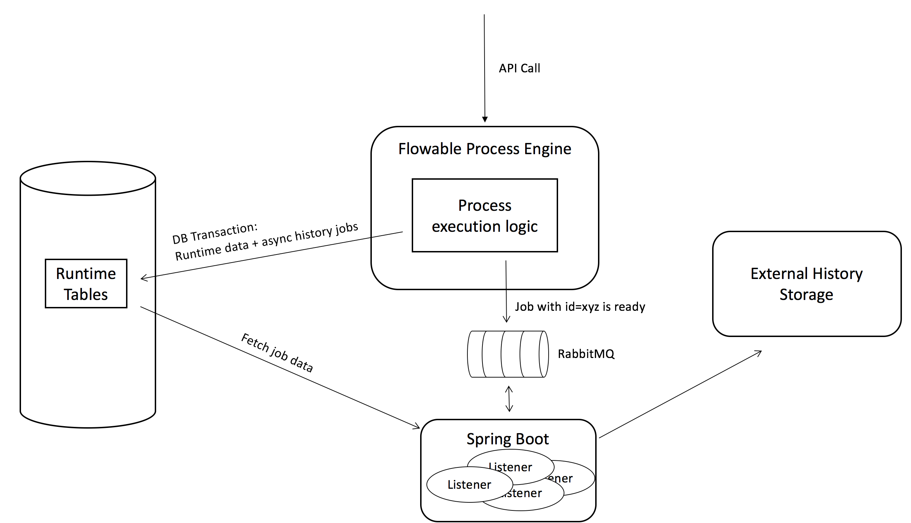

## Example: Flowable Async History configuration using RabbitMQ

### Description

This example builds upon the concepts described in the previous examples:

* [Configuring Async History using the out-of-the-box Async History Executor](../async-history-default-cfg)
* [Configuring Async History with a JMS Message Queue](../async-history-jms-cfg)

In this example: 

* RabbitMQ (https://www.rabbitmq.com/) is chosen as the Message Queue implementation, using the AMQP protocol
* The message listener, in contrast to the other JMS examples, will run on a different JVM using a simple Spring Boot application.

This architecture looks as follows:



The Spring Boot application with the message listener has its [own example project](../async-history-rabbitmq-springboot-listener), where all the implementation details about that side of the story are described.

Important to note here, is that transactional semantics are all taken care of by the Flowable Process Engine. The history data will be stored in the same transaction as the runtime data. As such, any component in this setup can fail, but the history data is guaranteed to be correct at any time. 

The Spring Boot application that contains the message listener uses the Flowable API to easily access the history data. In this example the message is printed, but it's easy to see what would be needed if it was desired to send to data to an external data store.

Setting up RabbitMQ is out of scope for this example, but shouldn't be difficult (On OS X, running _brew install rabbitmq_ and then _rabbitmq-server_ does the trick). 

### Dependencies

The usual dependencies (Flowable engine, DB driver and connection pooling framework) are used here, with one additional dependency: _spring-rabbit_. This dependency is part of the larger _Spring AMQP_ project and adds transitively the AMQP and RabbitMQ dependencies (which would have to be added separately when not using Spring). See the [pom.xml](pom.xml) for all details.


```xml
<dependency>
	<groupId>org.springframework.amqp</groupId>
	<artifactId>spring-rabbit</artifactId>
	<version>${spring.amqp.version}</version>
</dependency>
```

### Code 
 
The [example process](src/main/resources/test-process.bpmn20.xml) and [code to run it](src/main/java/org/flowable/Example.java) are exactly the same as in the the other examples. 
 
The configuration class is where the important stuff happens and can be found at [src/main/java/org/flowable/Configuration](src/main/java/org/flowable/Configuration.java).
 
First of all, the Aynch History Executor needs to be enabled and configured to run in 'message queue mode', which will boot up the Async History Executor in a _light_ mode, where the jobs are only infrequently inspected to see if history jobs were missed (could potentially happen when the Message Queue crashes or the like):

```java
config.setAsyncHistoryEnabled(true);
config.setAsyncHistoryExecutorActivate(true);
config.setAsyncHistoryExecutorMessageQueueMode(true);
```

The engine will take care of sending a message to the Message Queue at the correct time and only the actual sending of the message needs to be implemented by providing a custom implementation of the _JobManager_, which is named _RabbitMQMessageBasedJobManager_ here. The easiest way is to extend the _AbstractMessageBadedJobManager_. The implementation is quite simple, by using the _RabbitTemplate_ from the Spring AMQP project for passing the job identifier to a RabbitMQ exchange (named _flowable-exchange_ and using a routing key _flowable-history-jobs_):

```java
public class RabbitMQMessageBasedJobManager extends AbstractMessageBasedJobManager {

    private RabbitTemplate rabbitTemplate;
    
    protected void sendMessage(JobInfo job) {
        rabbitTemplate.convertAndSend("flowable-exchange", "flowable-history-jobs", job.getId());
    }

    public RabbitTemplate getRabbitTemplate() {
        return rabbitTemplate;
    }

    public void setRabbitTemplate(RabbitTemplate rabbitTemplate) {
        this.rabbitTemplate = rabbitTemplate;
    }
    
}
```

To make this work, the _RabbitTemplate_ needs to know the connection details of the RabbitMQ installation, by having a _ConnectionFactory_. The configuration looks as follows:

```java
@Bean
public RabbitMqMessageBasedJobManager jobManager() {
	RabbitMqMessageBasedJobManager jobManager = new RabbitMqMessageBasedJobManager();
	jobManager.setRabbitTemplate(rabbitTemplate());
	return jobManager;
}

@Bean
public ConnectionFactory connectionFactory() {
	CachingConnectionFactory connectionFactory = new CachingConnectionFactory("localhost");
	connectionFactory.setUsername("guest");
	connectionFactory.setPassword("guest");
    return connectionFactory;
}

@Bean
public RabbitTemplate rabbitTemplate() {
	RabbitTemplate rabbitTemplate = new RabbitTemplate();
	rabbitTemplate.setConnectionFactory(connectionFactory());
	rabbitTemplate.setExchange("flowable-exchange");
	return rabbitTemplate;
}
```

The last bit is to inject this custom _JobManager_ into the Process Engine configuration.

```java
config.setJobManager(jobManager());
```

When the [Example](src/main/java/org/flowable/Example.java) is now executed, messages will be sent to the RabbitMQ instance. This can be seen in the admin view of RabbitMQ (by default running on http://localhost:15672/) or, more interesting, boot the [Spring Boot application](../async-history-rabbitmq-springboot-listener) with a message listener that processes these messages.

